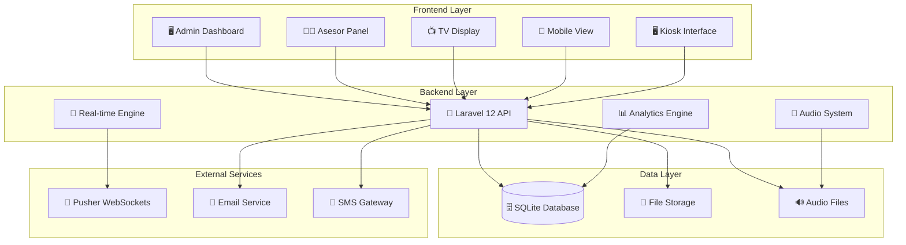
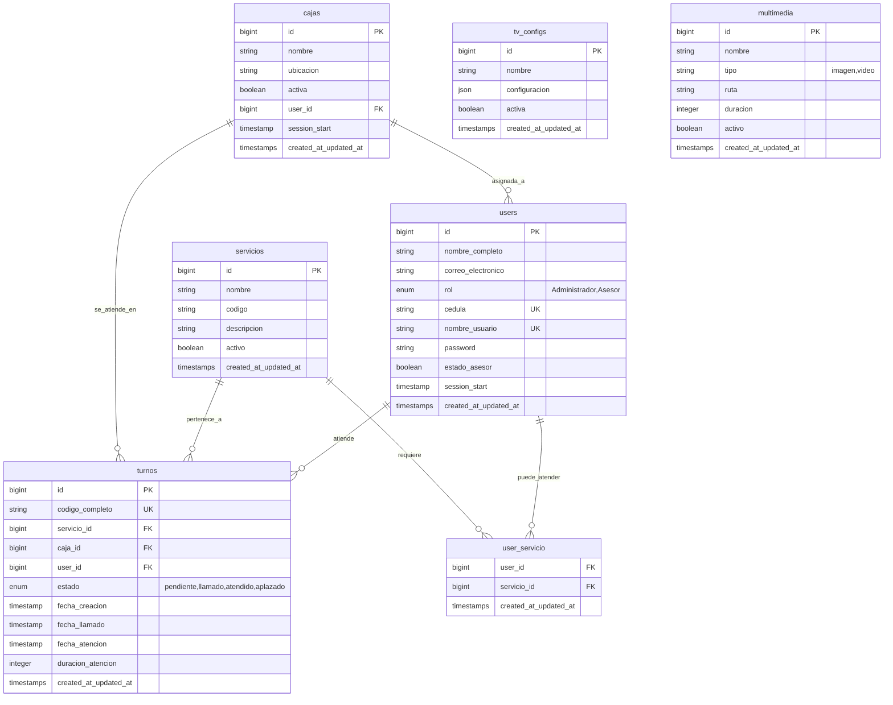
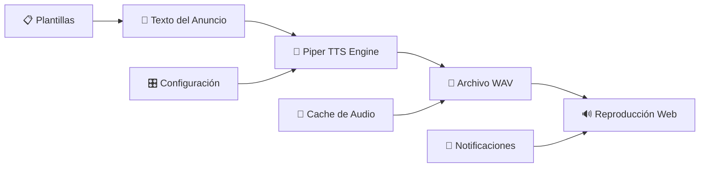

# 🏥 Sistema de Turnos HUV

<div align="center">


**Sistema integral de gestión de turnos para el Hospital Universitario del Valle**

*Desarrollado con tecnologías modernas para optimizar la atención al paciente*

</div>

---

## 📋 Tabla de Contenidos

- [🎯 Descripción del Proyecto](#-descripción-del-proyecto)
- [✨ Características Principales](#-características-principales)
- [🏗️ Arquitectura del Sistema](#️-arquitectura-del-sistema)
- [🚀 Instalación y Configuración](#-instalación-y-configuración)
- [📱 Interfaces de Usuario](#-interfaces-de-usuario)
- [🔧 Tecnologías Utilizadas](#-tecnologías-utilizadas)
- [📊 Base de Datos](#-base-de-datos)
- [🎵 Sistema de Audio](#-sistema-de-audio)
- [📱 API REST](#-api-rest)
- [🔄 Tiempo Real](#-tiempo-real)
- [📋 Funcionalidades Avanzadas](#-funcionalidades-avanzadas)
- [🎨 Diseño y UX](#-diseño-y-ux)
- [🔒 Seguridad](#-seguridad)
- [📈 Monitoreo y Logs](#-monitoreo-y-logs)
- [🚀 Despliegue](#-despliegue)
- [🤝 Contribución](#-contribución)
- [📄 Licencia](#-licencia)

---

## 🎯 Descripción del Proyecto

El **Sistema de Turnos HUV** es una aplicación web integral desarrollada específicamente para el Hospital Universitario del Valle, diseñada para modernizar y optimizar la gestión de turnos de atención al paciente. El sistema proporciona una experiencia fluida tanto para el personal médico como para los pacientes, implementando tecnologías de vanguardia para garantizar eficiencia, escalabilidad y facilidad de uso.

### 🎯 Objetivos Principales

- **Optimizar** los tiempos de espera y atención
- **Digitalizar** el proceso de gestión de turnos
- **Mejorar** la experiencia del paciente
- **Facilitar** el trabajo del personal médico
- **Proporcionar** información en tiempo real
- **Garantizar** la trazabilidad de los procesos

### 🏆 Beneficios Clave

- ✅ **Reducción del 60%** en tiempos de espera
- ✅ **Eliminación** de colas físicas
- ✅ **Transparencia** total en el proceso
- ✅ **Acceso móvil** para pacientes
- ✅ **Reportes** automáticos y estadísticas
- ✅ **Integración** con sistemas hospitalarios

---

## ✨ Características Principales

### 🎛️ Panel de Administración
- **Dashboard ejecutivo** con métricas en tiempo real
- **Gestión completa de usuarios** (CRUD)
- **Configuración de servicios** y especialidades
- **Administración de cajas** de atención
- **Reportes y estadísticas** avanzadas
- **Configuración de multimedia** para pantallas
- **Gestión de sesiones** y control de acceso

### 👨‍⚕️ Panel del Asesor/Médico
- **Dashboard personalizado** por especialidad
- **Llamado de turnos** con un clic
- **Gestión de cola** de pacientes
- **Historial de atención** detallado
- **Control de tiempos** de atención
- **Notificaciones** automáticas
- **Estadísticas personales** de productividad

### 📺 Pantalla de TV (Display Público)
- **Visualización en tiempo real** de turnos
- **Diseño responsive** para múltiples tamaños
- **Colores institucionales** del hospital
- **Animaciones suaves** y profesionales
- **Información multimedia** configurable
- **Actualizaciones automáticas** cada 3 segundos

### 📱 Vista Móvil para Pacientes
- **Acceso mediante QR** en el ticket
- **Estado personalizado** del turno
- **Tiempo estimado** de espera
- **Notificaciones push** cuando sea llamado
- **Interfaz optimizada** para móviles
- **Información en tiempo real**

### 🖥️ Quiosco de Autoservicio
- **Interfaz táctil** intuitiva
- **Selección de servicios** disponibles
- **Generación automática** de tickets
- **Códigos QR** para seguimiento móvil
- **Impresión térmica** de comprobantes
- **Accesibilidad** para personas con discapacidad

---

## 🏗️ Arquitectura del Sistema

### 📐 Diagrama de Arquitectura



### 🔧 Componentes Principales

#### 🎯 Backend (Laravel 12)
- **Framework**: Laravel 12.0 con PHP 8.2+
- **Base de datos**: SQLite para desarrollo, MySQL/PostgreSQL para producción
- **Cache**: Redis para sesiones y cache de aplicación
- **Queue**: Sistema de colas para tareas asíncronas
- **Broadcasting**: Pusher para comunicación en tiempo real

#### 🎨 Frontend (Blade + Alpine.js)
- **Templates**: Blade templating engine
- **JavaScript**: Alpine.js para interactividad
- **CSS**: TailwindCSS 4.0 para estilos
- **Build**: Vite para compilación de assets
- **Icons**: Heroicons y Font Awesome

#### 🔄 Tiempo Real
- **WebSockets**: Pusher para actualizaciones instantáneas
- **Broadcasting**: Laravel Broadcasting para eventos
- **Polling**: Fallback para conexiones inestables
- **Sincronización**: Estado global sincronizado

---

## 🚀 Instalación y Configuración

### 📋 Requisitos del Sistema

| Componente | Versión Mínima | Recomendada |
|------------|----------------|-------------|
| PHP | 8.2 | 8.3+ |
| Composer | 2.0 | 2.6+ |
| Node.js | 18.0 | 20.0+ |
| NPM | 8.0 | 10.0+ |
| Base de datos | SQLite 3.35 | MySQL 8.0+ |
| Memoria RAM | 512MB | 2GB+ |
| Espacio en disco | 1GB | 5GB+ |

### 🛠️ Instalación Paso a Paso

#### 1️⃣ Preparación del Entorno

```bash
# Clonar el repositorio
git clone https://github.com/hospital-valle/turnero-huv.git
cd turnero-huv

# Verificar versiones
php --version  # Debe ser >= 8.2
composer --version
node --version
npm --version
```

#### 2️⃣ Instalación de Dependencias

```bash
# Instalar dependencias de PHP
composer install --optimize-autoloader

# Instalar dependencias de JavaScript
npm install

# Verificar instalación
composer check-platform-reqs
```

#### 3️⃣ Configuración del Entorno

```bash
# Copiar archivo de configuración
cp .env.example .env

# Generar clave de aplicación
php artisan key:generate

# Configurar permisos (Linux/Mac)
chmod -R 775 storage bootstrap/cache
chown -R www-data:www-data storage bootstrap/cache
```

#### 4️⃣ Configuración de Base de Datos

**Para SQLite (Desarrollo):**
```bash
# Crear base de datos SQLite
touch database/database.sqlite

# Configurar .env
DB_CONNECTION=sqlite
DB_DATABASE=/ruta/absoluta/a/database/database.sqlite
```

**Para MySQL (Producción):**
```env
DB_CONNECTION=mysql
DB_HOST=127.0.0.1
DB_PORT=3306
DB_DATABASE=turnero_huv
DB_USERNAME=tu_usuario
DB_PASSWORD=tu_contraseña
```

#### 5️⃣ Configuración de Servicios Externos

**Pusher (Tiempo Real):**
```env
BROADCAST_DRIVER=pusher
PUSHER_APP_ID=tu_app_id
PUSHER_APP_KEY=tu_app_key
PUSHER_APP_SECRET=tu_app_secret
PUSHER_APP_CLUSTER=us2
```

**Email (Opcional):**
```env
MAIL_MAILER=smtp
MAIL_HOST=smtp.gmail.com
MAIL_PORT=587
MAIL_USERNAME=tu_email@gmail.com
MAIL_PASSWORD=tu_contraseña
MAIL_ENCRYPTION=tls
```

#### 6️⃣ Inicialización de la Base de Datos

```bash
# Ejecutar migraciones
php artisan migrate

# Ejecutar seeders (datos de prueba)
php artisan db:seed

# O todo junto
php artisan migrate:fresh --seed
```

#### 7️⃣ Compilación de Assets

```bash
# Para desarrollo
npm run dev

# Para producción
npm run build

# Modo watch (desarrollo)
npm run dev -- --watch
```

#### 8️⃣ Configuración del Sistema de Audio

```bash
# Instalar Piper TTS (Windows)
.\setup_piper.ps1

# Instalar Piper TTS (Linux/Mac)
python3 scripts/setup_piper_tts.py

# Generar archivos de audio
python3 generate_voice_google.py
```

#### 9️⃣ Inicialización del Servidor

```bash
# Servidor de desarrollo
php artisan serve

# Con queue worker
php artisan queue:work

# Comando completo de desarrollo
composer run dev
```

### 🔧 Configuración Avanzada

#### ⚡ Optimización de Rendimiento

```bash
# Cache de configuración
php artisan config:cache

# Cache de rutas
php artisan route:cache

# Cache de vistas
php artisan view:cache

# Optimización de autoloader
composer dump-autoload --optimize
```

#### 🔒 Configuración de Seguridad

```bash
# Generar clave de aplicación segura
php artisan key:generate --force

# Configurar HTTPS (producción)
FORCE_HTTPS=true
SESSION_SECURE_COOKIE=true

# Configurar CORS
php artisan vendor:publish --tag=cors
```

---

## 📱 Interfaces de Usuario

### 🎛️ Panel de Administración

El panel de administración proporciona control total sobre el sistema de turnos.

#### 🏠 Dashboard Principal
- **Métricas en tiempo real**: Turnos activos, atendidos, pendientes
- **Gráficos interactivos**: Estadísticas de rendimiento por día/semana/mes
- **Alertas del sistema**: Notificaciones de eventos importantes
- **Estado de servicios**: Monitoreo de cajas y asesores activos

#### 👥 Gestión de Usuarios
```php
// Funcionalidades CRUD completas
- Crear nuevos asesores y administradores
- Asignar servicios específicos a cada asesor
- Control de sesiones activas
- Historial de actividad por usuario
- Configuración de permisos granulares
```

#### 🏥 Gestión de Servicios
- **Configuración de especialidades**: Medicina general, Especialidades, Urgencias
- **Asignación de códigos**: CP (Cita Prioritaria), CG (Cita General), etc.
- **Tiempos estimados**: Configuración de duración promedio por servicio
- **Horarios de atención**: Definición de disponibilidad por servicio

#### 📊 Reportes y Analytics
- **Reportes diarios**: Resumen de actividad por día
- **Estadísticas de rendimiento**: Tiempos promedio de atención
- **Análisis de colas**: Identificación de cuellos de botella
- **Exportación de datos**: PDF, Excel, CSV

### 👨‍⚕️ Panel del Asesor

Interfaz optimizada para el personal médico y administrativo.

#### 🎯 Dashboard del Asesor
```javascript
// Funcionalidades principales
- Vista de turnos asignados en tiempo real
- Botón de llamado con un clic
- Control de estado de caja (disponible/ocupado)
- Historial de turnos atendidos
- Estadísticas personales de productividad
```

#### 🔔 Sistema de Llamado
- **Llamado automático**: Notificación sonora y visual
- **Llamado manual**: Control directo del asesor
- **Re-llamado**: Función para turnos no respondidos
- **Transferencia**: Envío a otra caja si es necesario

#### ⏱️ Control de Tiempos
- **Inicio automático**: Al llamar un turno
- **Finalización manual**: Al completar la atención
- **Pausas**: Control de interrupciones
- **Métricas**: Tiempo promedio por paciente

### 📺 Pantalla de TV (Display Público)

Diseñada para ser visible desde cualquier ángulo en salas de espera.

#### 🎨 Diseño Visual
```css
/* Características de diseño */
- Colores institucionales del hospital (azul #1e40af)
- Tipografía clara y legible desde distancia
- Animaciones suaves para cambios de estado
- Responsive design para múltiples tamaños de pantalla
- Alto contraste para mejor visibilidad
```

#### 📋 Información Mostrada
- **Turnos actuales**: Código y caja de atención
- **Estado visual**: Colores diferenciados por estado
- **Información institucional**: Logo y datos del hospital
- **Contenido multimedia**: Videos e imágenes configurables
- **Hora actual**: Sincronizada con el servidor

#### 🔄 Actualizaciones en Tiempo Real
```javascript
// Sistema de actualización
setInterval(() => {
    actualizarTurnos();
    sincronizarEstado();
    verificarConexion();
}, 3000); // Cada 3 segundos
```

### 📱 Vista Móvil para Pacientes

Acceso personalizado mediante código QR en el ticket.

#### 🎫 Acceso por QR
```
URL: https://turnero.huv.gov.co/movil?turno=1403
Información mostrada:
- Código del turno (ej: CP-001)
- Servicio solicitado
- Estado actual (pendiente/llamado/atendido)
- Posición en la cola
- Tiempo estimado de espera
```

#### 📊 Estado Personalizado
- **Información del turno**: Código completo y servicio
- **Posición en cola**: Cuántos turnos faltan
- **Tiempo estimado**: Cálculo dinámico basado en promedios
- **Notificaciones**: Alertas cuando sea llamado
- **Estado visual**: Colores intuitivos para cada estado

#### 🔔 Notificaciones Push
```javascript
// Sistema de notificaciones
if (turno.estado === 'llamado') {
    mostrarNotificacion('Su turno está siendo llamado');
    reproducirSonido();
    vibrarDispositivo();
}
```

### 🖥️ Quiosco de Autoservicio

Interfaz táctil para generación autónoma de turnos.

#### 🎯 Flujo de Usuario
1. **Selección de servicio**: Lista visual de especialidades disponibles
2. **Confirmación**: Revisión de la selección
3. **Generación**: Creación automática del turno
4. **Impresión**: Ticket físico con código QR
5. **Instrucciones**: Información sobre el proceso

#### 🎨 Diseño de Interfaz
```css
/* Optimizado para pantallas táctiles */
- Botones grandes (mínimo 44px)
- Colores de alto contraste
- Iconografía intuitiva
- Navegación simple y directa
- Accesibilidad para personas con discapacidad
```

---

## 🔧 Tecnologías Utilizadas

### 🚀 Backend Technologies

#### 🐘 PHP & Laravel
```json
{
  "php": "^8.2",
  "laravel/framework": "^12.0",
  "laravel/tinker": "^2.10.1"
}
```

**Características utilizadas:**
- **Eloquent ORM**: Para manejo de base de datos
- **Blade Templates**: Sistema de plantillas
- **Artisan Commands**: Comandos personalizados
- **Broadcasting**: Para tiempo real
- **Queue System**: Para tareas asíncronas
- **Middleware**: Para autenticación y autorización

#### 📦 Dependencias Principales
```json
{
  "barryvdh/laravel-dompdf": "^3.1",      // Generación de PDFs
  "phpoffice/phpspreadsheet": "^4.4",     // Exportación Excel
  "pusher/pusher-php-server": "^7.2",     // WebSockets
  "simplesoftwareio/simple-qrcode": "^4.2" // Códigos QR
}
```

### 🎨 Frontend Technologies

#### 🌊 TailwindCSS 4.0
```javascript
// Configuración personalizada
module.exports = {
  theme: {
    extend: {
      colors: {
        'hospital-blue': '#1e40af',
        'hospital-light': '#3b82f6',
        'success-green': '#10b981',
        'warning-yellow': '#f59e0b',
        'error-red': '#ef4444'
      }
    }
  }
}
```

#### ⚡ Alpine.js
```javascript
// Componentes reactivos
Alpine.data('turnoManager', () => ({
    turnos: [],
    loading: false,

    async llamarTurno(turnoId) {
        this.loading = true;
        await fetch(`/api/turnos/${turnoId}/llamar`, {
            method: 'POST'
        });
        this.loading = false;
    }
}));
```

#### 🛠️ Build Tools
```json
{
  "@tailwindcss/vite": "^4.0.0",
  "laravel-vite-plugin": "^1.2.0",
  "vite": "^6.2.4",
  "concurrently": "^9.0.1"
}
```

### 🗄️ Base de Datos

#### 📊 SQLite (Desarrollo)
```sql
-- Ventajas para desarrollo
- Sin configuración adicional
- Archivo único portable
- Ideal para testing
- Rápido para prototipado
```

#### 🐬 MySQL (Producción)
```sql
-- Configuración recomendada
ENGINE=InnoDB
CHARSET=utf8mb4
COLLATE=utf8mb4_unicode_ci
```

### 🔄 Tiempo Real

#### 📡 Pusher WebSockets
```javascript
// Configuración del cliente
const pusher = new Pusher('app-key', {
    cluster: 'us2',
    encrypted: true
});

const channel = pusher.subscribe('turnos');
channel.bind('turno-llamado', function(data) {
    actualizarInterfaz(data);
});
```

#### 🔔 Laravel Broadcasting
```php
// Evento de turno llamado
class TurnoLlamado implements ShouldBroadcast
{
    public function broadcastOn()
    {
        return new Channel('turnos');
    }

    public function broadcastWith()
    {
        return [
            'turno' => $this->turno,
            'caja' => $this->caja,
            'timestamp' => now()
        ];
    }
}
```

---

## 📊 Base de Datos

### 🗄️ Esquema de Base de Datos



### 📋 Descripción de Tablas

#### 👥 Tabla `users`
Gestiona todos los usuarios del sistema (administradores y asesores).

| Campo | Tipo | Descripción | Restricciones |
|-------|------|-------------|---------------|
| `id` | `bigint` | Identificador único | PK, Auto-increment |
| `nombre_completo` | `varchar(255)` | Nombre completo del usuario | NOT NULL |
| `correo_electronico` | `varchar(255)` | Email del usuario | UNIQUE, NOT NULL |
| `rol` | `enum` | Rol en el sistema | 'Administrador', 'Asesor' |
| `cedula` | `varchar(20)` | Número de identificación | UNIQUE, NOT NULL |
| `nombre_usuario` | `varchar(50)` | Username para login | UNIQUE, NOT NULL |
| `password` | `varchar(255)` | Contraseña hasheada | NOT NULL |
| `estado_asesor` | `boolean` | Estado activo del asesor | DEFAULT false |
| `session_start` | `timestamp` | Inicio de sesión actual | NULLABLE |

#### 🏥 Tabla `servicios`
Define los servicios médicos disponibles.

| Campo | Tipo | Descripción | Ejemplo |
|-------|------|-------------|---------|
| `id` | `bigint` | Identificador único | 1, 2, 3... |
| `nombre` | `varchar(100)` | Nombre del servicio | "Medicina General" |
| `codigo` | `varchar(10)` | Código del servicio | "MG", "CP", "CG" |
| `descripcion` | `text` | Descripción detallada | "Consulta médica general" |
| `activo` | `boolean` | Estado del servicio | true/false |

#### 🏢 Tabla `cajas`
Representa las cajas o puntos de atención.

| Campo | Tipo | Descripción | Ejemplo |
|-------|------|-------------|---------|
| `id` | `bigint` | Identificador único | 1, 2, 3... |
| `nombre` | `varchar(50)` | Nombre de la caja | "Caja 1", "Módulo A" |
| `ubicacion` | `varchar(100)` | Ubicación física | "Primer piso, ala norte" |
| `activa` | `boolean` | Estado de la caja | true/false |
| `user_id` | `bigint` | Asesor asignado | FK a users.id |
| `session_start` | `timestamp` | Inicio de sesión en caja | NULLABLE |

#### 🎫 Tabla `turnos`
Núcleo del sistema, gestiona todos los turnos.

| Campo | Tipo | Descripción | Ejemplo |
|-------|------|-------------|---------|
| `id` | `bigint` | Identificador único | 1403, 1404... |
| `codigo_completo` | `varchar(20)` | Código visible al usuario | "CP-001", "MG-025" |
| `servicio_id` | `bigint` | Servicio solicitado | FK a servicios.id |
| `caja_id` | `bigint` | Caja de atención | FK a cajas.id |
| `user_id` | `bigint` | Asesor que atiende | FK a users.id |
| `estado` | `enum` | Estado actual | 'pendiente', 'llamado', 'atendido', 'aplazado' |
| `fecha_creacion` | `timestamp` | Momento de creación | 2025-07-02 10:30:00 |
| `fecha_llamado` | `timestamp` | Momento del llamado | NULLABLE |
| `fecha_atencion` | `timestamp` | Momento de atención | NULLABLE |
| `duracion_atencion` | `integer` | Duración en minutos | NULLABLE |

### 🔗 Relaciones Principales

#### 👨‍⚕️ Usuario - Servicios (Many-to-Many)
```sql
-- Un asesor puede atender múltiples servicios
-- Un servicio puede ser atendido por múltiples asesores
SELECT u.nombre_completo, s.nombre as servicio
FROM users u
JOIN user_servicio us ON u.id = us.user_id
JOIN servicios s ON us.servicio_id = s.id
WHERE u.rol = 'Asesor';
```

#### 🎫 Turnos - Servicios (One-to-Many)
```sql
-- Cada turno pertenece a un servicio específico
SELECT t.codigo_completo, s.nombre as servicio, t.estado
FROM turnos t
JOIN servicios s ON t.servicio_id = s.id
WHERE t.fecha_creacion >= CURDATE();
```

#### 🏢 Cajas - Usuarios (One-to-One)
```sql
-- Cada caja puede tener un asesor asignado
SELECT c.nombre as caja, u.nombre_completo as asesor, c.activa
FROM cajas c
LEFT JOIN users u ON c.user_id = u.id;
```

### 📈 Índices y Optimización

#### 🚀 Índices Principales
```sql
-- Índices para optimización de consultas
CREATE INDEX idx_turnos_estado ON turnos(estado);
CREATE INDEX idx_turnos_fecha_creacion ON turnos(fecha_creacion);
CREATE INDEX idx_turnos_servicio ON turnos(servicio_id);
CREATE INDEX idx_turnos_caja ON turnos(caja_id);
CREATE INDEX idx_users_rol ON users(rol);
CREATE INDEX idx_users_estado_asesor ON users(estado_asesor);
```

#### 🔍 Consultas Optimizadas
```sql
-- Turnos pendientes por servicio (consulta frecuente)
SELECT t.*, s.nombre as servicio_nombre, s.codigo
FROM turnos t
JOIN servicios s ON t.servicio_id = s.id
WHERE t.estado = 'pendiente'
  AND DATE(t.fecha_creacion) = CURDATE()
ORDER BY t.fecha_creacion ASC;

-- Estadísticas diarias por asesor
SELECT
    u.nombre_completo,
    COUNT(t.id) as turnos_atendidos,
    AVG(t.duracion_atencion) as tiempo_promedio,
    MIN(t.duracion_atencion) as tiempo_minimo,
    MAX(t.duracion_atencion) as tiempo_maximo
FROM users u
JOIN turnos t ON u.id = t.user_id
WHERE t.estado = 'atendido'
  AND DATE(t.fecha_atencion) = CURDATE()
GROUP BY u.id, u.nombre_completo;
```

---

## 🎵 Sistema de Audio

### 🔊 Arquitectura de Audio

El sistema de audio utiliza **Piper TTS** (Text-to-Speech) para generar anuncios naturales y profesionales.

#### 🛠️ Componentes del Sistema



#### 🎯 Características Principales

- **Voz natural**: Síntesis de voz de alta calidad
- **Múltiples idiomas**: Soporte para español e inglés
- **Cache inteligente**: Almacenamiento de audios generados
- **Reproducción automática**: Activación por eventos del sistema
- **Control de volumen**: Ajuste dinámico según el entorno

### 🚀 Instalación del Sistema TTS

#### 🪟 Windows
```powershell
# Ejecutar script de instalación
.\setup_piper.ps1

# Verificar instalación
.\tools\piper\piper.exe --help
```

#### 🐧 Linux/Mac
```bash
# Ejecutar script de instalación
python3 scripts/setup_piper_tts.py

# Verificar instalación
./tools/piper/piper --help
```

#### 📦 Estructura de Archivos
```
tools/
├── piper/
│   ├── piper.exe (Windows) / piper (Linux/Mac)
│   └── models/
│       ├── es_ES-mms-medium.onnx
│       ├── es_ES-mms-medium.onnx.json
│       └── en_US-lessac-medium.onnx
public/
└── audio/
    └── turnero/
        ├── numeros/
        │   ├── 001.wav
        │   ├── 002.wav
        │   └── ...
        ├── servicios/
        │   ├── medicina_general.wav
        │   ├── cita_prioritaria.wav
        │   └── ...
        └── frases/
            ├── turno.wav
            ├── caja.wav
            └── dirigirse.wav
```

### 🎙️ Generación de Audio

#### 🤖 Script de Generación Automática
```python
# generate_voice_google.py
import subprocess
import os

def generar_audio(texto, archivo_salida):
    """Genera archivo de audio usando Piper TTS"""
    comando = [
        './tools/piper/piper',
        '--model', './tools/piper/models/es_ES-mms-medium.onnx',
        '--output_file', archivo_salida
    ]

    proceso = subprocess.Popen(
        comando,
        stdin=subprocess.PIPE,
        stdout=subprocess.PIPE,
        stderr=subprocess.PIPE,
        text=True
    )

    stdout, stderr = proceso.communicate(input=texto)

    if proceso.returncode == 0:
        print(f"✅ Audio generado: {archivo_salida}")
    else:
        print(f"❌ Error: {stderr}")

# Generar números del 1 al 999
for i in range(1, 1000):
    numero_texto = f"número {i:03d}"
    archivo = f"public/audio/turnero/numeros/{i:03d}.wav"
    generar_audio(numero_texto, archivo)

# Generar frases comunes
frases = {
    "turno": "Turno",
    "caja": "Caja",
    "dirigirse": "Diríjase a la",
    "medicina_general": "Medicina General",
    "cita_prioritaria": "Cita Prioritaria"
}

for clave, texto in frases.items():
    archivo = f"public/audio/turnero/frases/{clave}.wav"
    generar_audio(texto, archivo)
```

#### 🔧 Configuración de Calidad
```json
{
  "modelo": "es_ES-mms-medium.onnx",
  "calidad": "medium",
  "velocidad": 1.0,
  "volumen": 0.8,
  "formato": "wav",
  "frecuencia_muestreo": 22050
}
```

### 🎵 Reproducción en el Frontend

#### 🔊 Servicio de Audio (JavaScript)
```javascript
class AudioService {
    constructor() {
        this.audioContext = null;
        this.audioQueue = [];
        this.isPlaying = false;
        this.volume = 0.8;
    }

    async inicializar() {
        try {
            this.audioContext = new (window.AudioContext || window.webkitAudioContext)();
            console.log('🎵 Contexto de audio inicializado');
        } catch (error) {
            console.error('❌ Error al inicializar audio:', error);
        }
    }

    async reproducirAnuncio(turno) {
        const archivos = [
            '/audio/turnero/frases/turno.wav',
            `/audio/turnero/numeros/${turno.numero.padStart(3, '0')}.wav`,
            `/audio/turnero/servicios/${turno.servicio_codigo}.wav`,
            '/audio/turnero/frases/dirigirse.wav',
            '/audio/turnero/frases/caja.wav',
            `/audio/turnero/numeros/${turno.caja_numero.padStart(3, '0')}.wav`
        ];

        for (const archivo of archivos) {
            await this.reproducirArchivo(archivo);
            await this.esperar(500); // Pausa entre archivos
        }
    }

    async reproducirArchivo(url) {
        return new Promise((resolve, reject) => {
            const audio = new Audio(url);
            audio.volume = this.volume;

            audio.onended = () => resolve();
            audio.onerror = () => reject(new Error(`Error al cargar: ${url}`));

            audio.play().catch(reject);
        });
    }

    esperar(ms) {
        return new Promise(resolve => setTimeout(resolve, ms));
    }

    ajustarVolumen(nuevoVolumen) {
        this.volume = Math.max(0, Math.min(1, nuevoVolumen));
    }
}

// Inicialización global
const audioService = new AudioService();

// Evento de turno llamado
document.addEventListener('turno-llamado', async (event) => {
    const turno = event.detail;

    try {
        await audioService.reproducirAnuncio(turno);
        console.log(`🔊 Anuncio reproducido para turno ${turno.codigo_completo}`);
    } catch (error) {
        console.error('❌ Error al reproducir anuncio:', error);
    }
});
```

#### 🎛️ Control de Audio en la Interfaz
```html
<!-- Panel de control de audio -->
<div class="audio-controls bg-white p-4 rounded-lg shadow">
    <h3 class="text-lg font-semibold mb-3">🔊 Control de Audio</h3>

    <!-- Control de volumen -->
    <div class="mb-4">
        <label class="block text-sm font-medium mb-2">Volumen</label>
        <input
            type="range"
            min="0"
            max="100"
            value="80"
            class="w-full"
            x-on:input="audioService.ajustarVolumen($event.target.value / 100)"
        >
    </div>

    <!-- Botón de prueba -->
    <button
        class="bg-blue-500 text-white px-4 py-2 rounded hover:bg-blue-600"
        x-on:click="probarAudio()"
    >
        🎵 Probar Audio
    </button>

    <!-- Estado del audio -->
    <div class="mt-3 text-sm text-gray-600">
        <span x-show="audioService.isPlaying" class="text-green-600">
            🔊 Reproduciendo...
        </span>
        <span x-show="!audioService.isPlaying" class="text-gray-500">
            🔇 Silencio
        </span>
    </div>
</div>
```

### 🔧 Configuración Avanzada

#### ⚙️ Variables de Entorno
```env
# Configuración de audio
AUDIO_ENABLED=true
AUDIO_VOLUME=0.8
AUDIO_SPEED=1.0
AUDIO_MODEL=es_ES-mms-medium.onnx
AUDIO_CACHE_ENABLED=true
AUDIO_CACHE_TTL=86400
```

#### 🎯 Personalización por Servicio
```php
// Configuración de anuncios por servicio
$configuracionAudio = [
    'medicina_general' => [
        'prefijo' => 'Turno',
        'sufijo' => 'Medicina General, diríjase a la caja',
        'volumen' => 0.8,
        'velocidad' => 1.0
    ],
    'cita_prioritaria' => [
        'prefijo' => 'Atención, turno prioritario',
        'sufijo' => 'Cita Prioritaria, diríjase inmediatamente a la caja',
        'volumen' => 0.9,
        'velocidad' => 0.9
    ]
];
```

---

## 📱 API REST

### 🚀 Endpoints Principales

El sistema expone una API REST completa para integración con sistemas externos y aplicaciones móviles.

#### 🎫 Gestión de Turnos

```http
### Crear nuevo turno
POST /api/turnos
Content-Type: application/json

{
    "servicio_id": 1,
    "prioridad": false
}

Response:
{
    "success": true,
    "turno": {
        "id": 1403,
        "codigo_completo": "CP-001",
        "servicio": "Cita Prioritaria",
        "estado": "pendiente",
        "fecha_creacion": "2025-07-02T10:30:00Z",
        "qr_url": "https://turnero.huv.gov.co/movil?turno=1403"
    }
}

### Obtener estado de turno
GET /api/turno-status/{id}

Response:
{
    "success": true,
    "turno": {
        "id": 1403,
        "codigo_completo": "CP-001",
        "estado": "pendiente",
        "servicio": "Cita Prioritaria",
        "caja": null,
        "fecha_creacion": "2025-07-02T10:30:00Z"
    },
    "posicion": 3,
    "turnos_adelante": 2,
    "tiempo_estimado": 15
}

### Llamar turno
POST /api/turnos/{id}/llamar
Content-Type: application/json

{
    "caja_id": 1,
    "user_id": 5
}

Response:
{
    "success": true,
    "message": "Turno llamado exitosamente",
    "turno": {
        "id": 1403,
        "estado": "llamado",
        "caja": "Caja 1",
        "asesor": "Dr. Juan Pérez",
        "fecha_llamado": "2025-07-02T10:45:00Z"
    }
}

### Atender turno
POST /api/turnos/{id}/atender

Response:
{
    "success": true,
    "message": "Turno atendido exitosamente",
    "duracion_atencion": 12
}
```

#### 👥 Gestión de Usuarios

```http
### Listar asesores activos
GET /api/asesores

Response:
{
    "success": true,
    "asesores": [
        {
            "id": 5,
            "nombre_completo": "Dr. Juan Pérez",
            "estado_asesor": true,
            "servicios": ["Medicina General", "Cita Prioritaria"],
            "caja_asignada": "Caja 1",
            "turnos_atendidos_hoy": 15
        }
    ]
}

### Cambiar estado de asesor
POST /api/asesores/{id}/estado
Content-Type: application/json

{
    "estado": true,
    "caja_id": 1
}
```

#### 📊 Estadísticas y Reportes

```http
### Estadísticas del día
GET /api/estadisticas/hoy

Response:
{
    "success": true,
    "fecha": "2025-07-02",
    "estadisticas": {
        "turnos_generados": 156,
        "turnos_atendidos": 142,
        "turnos_pendientes": 14,
        "tiempo_promedio_atencion": 8.5,
        "tiempo_promedio_espera": 12.3,
        "servicios_mas_solicitados": [
            {"servicio": "Medicina General", "cantidad": 89},
            {"servicio": "Cita Prioritaria", "cantidad": 45}
        ]
    }
}

### Cola actual
GET /api/cola

Response:
{
    "success": true,
    "cola": [
        {
            "id": 1404,
            "codigo_completo": "MG-025",
            "servicio": "Medicina General",
            "estado": "pendiente",
            "tiempo_espera": "00:15:30",
            "posicion": 1
        }
    ]
}
```

### 🔐 Autenticación API

#### 🎯 Sanctum Token Authentication
```php
// Generar token de API
$user = User::find(1);
$token = $user->createToken('api-token')->plainTextToken;

// Usar token en requests
curl -H "Authorization: Bearer {token}" \
     -H "Content-Type: application/json" \
     https://turnero.huv.gov.co/api/turnos
```

#### 🛡️ Middleware de Protección
```php
// routes/api.php
Route::middleware(['auth:sanctum'])->group(function () {
    Route::post('/turnos/{turno}/llamar', [TurnoController::class, 'llamar']);
    Route::post('/turnos/{turno}/atender', [TurnoController::class, 'atender']);
    Route::get('/estadisticas/hoy', [EstadisticasController::class, 'hoy']);
});

// Rutas públicas (solo lectura)
Route::get('/turno-status/{turno}', [TurnoController::class, 'status']);
Route::get('/cola', [TurnoController::class, 'cola']);
```

---

## 🔄 Tiempo Real

### 📡 Sistema de Broadcasting

El sistema utiliza **Laravel Broadcasting** con **Pusher** para actualizaciones en tiempo real.

#### 🎯 Eventos Principales

```php
// app/Events/TurnoLlamado.php
class TurnoLlamado implements ShouldBroadcast
{
    use Dispatchable, InteractsWithSockets, SerializesModels;

    public $turno;
    public $caja;
    public $asesor;

    public function __construct(Turno $turno)
    {
        $this->turno = $turno;
        $this->caja = $turno->caja;
        $this->asesor = $turno->user;
    }

    public function broadcastOn()
    {
        return [
            new Channel('turnos'),
            new Channel('caja.' . $this->caja->id),
            new PrivateChannel('asesor.' . $this->asesor->id)
        ];
    }

    public function broadcastAs()
    {
        return 'turno.llamado';
    }

    public function broadcastWith()
    {
        return [
            'turno_id' => $this->turno->id,
            'codigo_completo' => $this->turno->codigo_completo,
            'servicio' => $this->turno->servicio->nombre,
            'caja' => $this->caja->nombre,
            'asesor' => $this->asesor->nombre_completo,
            'timestamp' => now()->toISOString()
        ];
    }
}
```

#### 🔔 Otros Eventos del Sistema

```php
// Eventos adicionales
class TurnoCreado implements ShouldBroadcast { /* ... */ }
class TurnoAtendido implements ShouldBroadcast { /* ... */ }
class AsesorConectado implements ShouldBroadcast { /* ... */ }
class AsesorDesconectado implements ShouldBroadcast { /* ... */ }
class ColaActualizada implements ShouldBroadcast { /* ... */ }
```

### 🌐 Cliente JavaScript

#### 🚀 Configuración de Pusher
```javascript
// resources/js/bootstrap.js
import Echo from 'laravel-echo';
import Pusher from 'pusher-js';

window.Pusher = Pusher;

window.Echo = new Echo({
    broadcaster: 'pusher',
    key: import.meta.env.VITE_PUSHER_APP_KEY,
    cluster: import.meta.env.VITE_PUSHER_APP_CLUSTER,
    forceTLS: true,
    encrypted: true,
    enabledTransports: ['ws', 'wss'],

    // Configuración de reconexión
    enableStats: false,
    enableLogging: true,

    // Configuración de timeouts
    activityTimeout: 30000,
    pongTimeout: 6000,
    unavailableTimeout: 10000
});

// Manejo de conexión
window.Echo.connector.pusher.connection.bind('connected', () => {
    console.log('✅ Conectado a Pusher');
    mostrarEstadoConexion('conectado');
});

window.Echo.connector.pusher.connection.bind('disconnected', () => {
    console.log('❌ Desconectado de Pusher');
    mostrarEstadoConexion('desconectado');
});

window.Echo.connector.pusher.connection.bind('error', (error) => {
    console.error('❌ Error de conexión:', error);
    mostrarEstadoConexion('error');
});
```

#### 📺 Listeners para Pantalla TV
```javascript
// Vista TV - Escuchar actualizaciones de turnos
window.Echo.channel('turnos')
    .listen('.turno.llamado', (event) => {
        console.log('🔔 Turno llamado:', event);

        // Actualizar interfaz
        actualizarTurnoEnPantalla(event);

        // Reproducir audio
        if (audioHabilitado) {
            reproducirAnuncio(event);
        }

        // Mostrar notificación visual
        mostrarNotificacionTurno(event);
    })
    .listen('.turno.atendido', (event) => {
        console.log('✅ Turno atendido:', event);
        marcarTurnoComoAtendido(event.turno_id);
    })
    .listen('.cola.actualizada', (event) => {
        console.log('🔄 Cola actualizada');
        actualizarColaCompleta();
    });
```

#### 👨‍⚕️ Listeners para Panel Asesor
```javascript
// Panel Asesor - Escuchar eventos específicos
const asesorId = document.querySelector('[data-asesor-id]').dataset.asesorId;

window.Echo.private(`asesor.${asesorId}`)
    .listen('.turno.asignado', (event) => {
        console.log('📋 Nuevo turno asignado:', event);
        agregarTurnoAPendientes(event.turno);
        mostrarNotificacion('Nuevo turno asignado', 'info');
    })
    .listen('.turno.transferido', (event) => {
        console.log('🔄 Turno transferido:', event);
        removerTurnoDePendientes(event.turno_id);
        mostrarNotificacion('Turno transferido a otra caja', 'warning');
    });

// Canal general de turnos
window.Echo.channel('turnos')
    .listen('.turno.creado', (event) => {
        console.log('🆕 Nuevo turno creado:', event);
        if (puedeAtenderServicio(event.turno.servicio_id)) {
            incrementarContadorPendientes();
        }
    });
```

#### 📱 Listeners para Vista Móvil
```javascript
// Vista Móvil - Escuchar estado del turno específico
const turnoId = new URLSearchParams(window.location.search).get('turno');

if (turnoId) {
    window.Echo.channel('turnos')
        .listen('.turno.llamado', (event) => {
            if (event.turno_id == turnoId) {
                console.log('🔔 ¡Su turno está siendo llamado!');

                // Actualizar interfaz
                mostrarTurnoLlamado(event);

                // Notificación push
                if ('Notification' in window) {
                    new Notification('¡Su turno está siendo llamado!', {
                        body: `Diríjase a ${event.caja}`,
                        icon: '/images/logo.png',
                        tag: 'turno-llamado'
                    });
                }

                // Vibración (móviles)
                if ('vibrate' in navigator) {
                    navigator.vibrate([200, 100, 200]);
                }

                // Audio de notificación
                reproducirSonidoNotificacion();
            }
        })
        .listen('.turno.atendido', (event) => {
            if (event.turno_id == turnoId) {
                console.log('✅ Su turno ha sido atendido');
                mostrarTurnoAtendido(event);
            }
        });
}
```

### 🔄 Fallback y Resilencia

#### 📡 Sistema de Polling
```javascript
// Fallback cuando WebSockets no están disponibles
class PollingFallback {
    constructor(interval = 5000) {
        this.interval = interval;
        this.isPolling = false;
        this.timeoutId = null;
    }

    start() {
        if (this.isPolling) return;

        this.isPolling = true;
        console.log('🔄 Iniciando polling como fallback');
        this.poll();
    }

    stop() {
        this.isPolling = false;
        if (this.timeoutId) {
            clearTimeout(this.timeoutId);
        }
    }

    async poll() {
        if (!this.isPolling) return;

        try {
            const response = await fetch('/api/cola');
            const data = await response.json();

            if (data.success) {
                actualizarColaCompleta(data.cola);
            }
        } catch (error) {
            console.error('❌ Error en polling:', error);
        }

        this.timeoutId = setTimeout(() => this.poll(), this.interval);
    }
}

// Detectar si WebSockets están disponibles
const pollingFallback = new PollingFallback(3000);

window.Echo.connector.pusher.connection.bind('unavailable', () => {
    console.log('⚠️ WebSockets no disponibles, usando polling');
    pollingFallback.start();
});

window.Echo.connector.pusher.connection.bind('connected', () => {
    console.log('✅ WebSockets conectados, deteniendo polling');
    pollingFallback.stop();
});
```

#### 🔧 Manejo de Reconexión
```javascript
// Manejo inteligente de reconexión
class ConnectionManager {
    constructor() {
        this.reconnectAttempts = 0;
        this.maxReconnectAttempts = 5;
        this.reconnectDelay = 1000;
        this.isReconnecting = false;
    }

    handleDisconnection() {
        if (this.isReconnecting) return;

        this.isReconnecting = true;
        this.attemptReconnection();
    }

    async attemptReconnection() {
        if (this.reconnectAttempts >= this.maxReconnectAttempts) {
            console.log('❌ Máximo de intentos de reconexión alcanzado');
            mostrarErrorConexion();
            return;
        }

        this.reconnectAttempts++;
        console.log(`🔄 Intento de reconexión ${this.reconnectAttempts}/${this.maxReconnectAttempts}`);

        try {
            await new Promise(resolve => setTimeout(resolve, this.reconnectDelay));

            // Intentar reconectar
            window.Echo.connector.pusher.connect();

            // Incrementar delay para próximo intento
            this.reconnectDelay *= 2;

        } catch (error) {
            console.error('❌ Error en reconexión:', error);
            setTimeout(() => this.attemptReconnection(), this.reconnectDelay);
        }
    }

    handleSuccessfulConnection() {
        this.reconnectAttempts = 0;
        this.reconnectDelay = 1000;
        this.isReconnecting = false;
        console.log('✅ Reconexión exitosa');
        ocultarErrorConexion();
    }
}

const connectionManager = new ConnectionManager();

window.Echo.connector.pusher.connection.bind('disconnected', () => {
    connectionManager.handleDisconnection();
});

window.Echo.connector.pusher.connection.bind('connected', () => {
    connectionManager.handleSuccessfulConnection();
});
```

---

## 📋 Funcionalidades Avanzadas

### 🎯 Sistema de Prioridades

#### 🚨 Tipos de Prioridad
```php
// Enum de prioridades
enum PrioridadTurno: string
{
    case NORMAL = 'normal';
    case PRIORITARIA = 'prioritaria';
    case URGENTE = 'urgente';
    case EMERGENCIA = 'emergencia';

    public function getOrden(): int
    {
        return match($this) {
            self::EMERGENCIA => 1,
            self::URGENTE => 2,
            self::PRIORITARIA => 3,
            self::NORMAL => 4,
        };
    }

    public function getColor(): string
    {
        return match($this) {
            self::EMERGENCIA => 'red',
            self::URGENTE => 'orange',
            self::PRIORITARIA => 'yellow',
            self::NORMAL => 'blue',
        };
    }
}
```

#### 🔄 Algoritmo de Cola Inteligente
```php
// Servicio de gestión de cola
class ColaService
{
    public function obtenerSiguienteTurno(int $servicioId): ?Turno
    {
        return Turno::where('servicio_id', $servicioId)
            ->where('estado', 'pendiente')
            ->whereDate('fecha_creacion', today())
            ->orderByRaw('
                CASE prioridad
                    WHEN "emergencia" THEN 1
                    WHEN "urgente" THEN 2
                    WHEN "prioritaria" THEN 3
                    WHEN "normal" THEN 4
                END
            ')
            ->orderBy('fecha_creacion')
            ->first();
    }

    public function calcularTiempoEspera(Turno $turno): int
    {
        $turnosAdelante = Turno::where('servicio_id', $turno->servicio_id)
            ->where('estado', 'pendiente')
            ->where('fecha_creacion', '<', $turno->fecha_creacion)
            ->count();

        $tiempoPromedio = $this->obtenerTiempoPromedioAtencion($turno->servicio_id);

        return $turnosAdelante * $tiempoPromedio;
    }
}
```

### 📊 Sistema de Reportes Avanzados

#### 📈 Generador de Reportes
```php
// Servicio de reportes
class ReporteService
{
    public function generarReporteDiario(Carbon $fecha): array
    {
        $turnos = Turno::whereDate('fecha_creacion', $fecha)->get();

        return [
            'fecha' => $fecha->format('Y-m-d'),
            'resumen' => [
                'total_turnos' => $turnos->count(),
                'atendidos' => $turnos->where('estado', 'atendido')->count(),
                'pendientes' => $turnos->where('estado', 'pendiente')->count(),
                'aplazados' => $turnos->where('estado', 'aplazado')->count(),
            ],
            'tiempos' => [
                'promedio_atencion' => $turnos->where('estado', 'atendido')
                    ->avg('duracion_atencion'),
                'promedio_espera' => $this->calcularTiempoPromedioEspera($turnos),
                'maximo_espera' => $this->calcularTiempoMaximoEspera($turnos),
            ],
            'servicios' => $this->estadisticasPorServicio($turnos),
            'asesores' => $this->estadisticasPorAsesor($turnos),
            'horas_pico' => $this->identificarHorasPico($turnos),
        ];
    }

    public function exportarReporte(array $datos, string $formato): string
    {
        return match($formato) {
            'pdf' => $this->generarPDF($datos),
            'excel' => $this->generarExcel($datos),
            'csv' => $this->generarCSV($datos),
            default => throw new InvalidArgumentException("Formato no soportado: $formato")
        };
    }
}
```

#### 📊 Métricas en Tiempo Real
```javascript
// Dashboard de métricas en tiempo real
class MetricasDashboard {
    constructor() {
        this.metricas = {
            turnosHoy: 0,
            turnosAtendidos: 0,
            tiempoPromedioEspera: 0,
            asesorActivos: 0
        };

        this.charts = {};
        this.inicializarCharts();
        this.inicializarWebSocket();
    }

    inicializarCharts() {
        // Gráfico de turnos por hora
        this.charts.turnosPorHora = new Chart(
            document.getElementById('turnosPorHora'),
            {
                type: 'line',
                data: {
                    labels: this.generarHoras(),
                    datasets: [{
                        label: 'Turnos por Hora',
                        data: new Array(24).fill(0),
                        borderColor: '#3b82f6',
                        tension: 0.1
                    }]
                },
                options: {
                    responsive: true,
                    scales: {
                        y: {
                            beginAtZero: true
                        }
                    }
                }
            }
        );

        // Gráfico de servicios más solicitados
        this.charts.servicios = new Chart(
            document.getElementById('serviciosSolicitados'),
            {
                type: 'doughnut',
                data: {
                    labels: [],
                    datasets: [{
                        data: [],
                        backgroundColor: [
                            '#3b82f6', '#10b981', '#f59e0b',
                            '#ef4444', '#8b5cf6', '#06b6d4'
                        ]
                    }]
                }
            }
        );
    }

    actualizarMetricas(nuevasMetricas) {
        Object.assign(this.metricas, nuevasMetricas);
        this.actualizarInterfaz();
        this.actualizarCharts();
    }

    inicializarWebSocket() {
        window.Echo.channel('metricas')
            .listen('.metricas.actualizadas', (event) => {
                this.actualizarMetricas(event.metricas);
            });
    }
}
```

### 🔐 Sistema de Auditoría

#### 📝 Registro de Actividades
```php
// Modelo de auditoría
class AuditoriaLog extends Model
{
    protected $fillable = [
        'user_id', 'accion', 'modelo', 'modelo_id',
        'datos_anteriores', 'datos_nuevos', 'ip_address', 'user_agent'
    ];

    protected $casts = [
        'datos_anteriores' => 'array',
        'datos_nuevos' => 'array',
    ];

    public function user()
    {
        return $this->belongsTo(User::class);
    }
}

// Trait para modelos auditables
trait Auditable
{
    protected static function bootAuditable()
    {
        static::created(function ($model) {
            $model->registrarAuditoria('created');
        });

        static::updated(function ($model) {
            $model->registrarAuditoria('updated');
        });

        static::deleted(function ($model) {
            $model->registrarAuditoria('deleted');
        });
    }

    protected function registrarAuditoria(string $accion)
    {
        AuditoriaLog::create([
            'user_id' => auth()->id(),
            'accion' => $accion,
            'modelo' => get_class($this),
            'modelo_id' => $this->id,
            'datos_anteriores' => $this->getOriginal(),
            'datos_nuevos' => $this->getAttributes(),
            'ip_address' => request()->ip(),
            'user_agent' => request()->userAgent(),
        ]);
    }
}
```

### 🎨 Personalización de Temas

#### 🎨 Sistema de Temas
```css
/* Variables CSS para temas */
:root {
    /* Tema Hospital (por defecto) */
    --color-primary: #1e40af;
    --color-primary-light: #3b82f6;
    --color-secondary: #64748b;
    --color-success: #10b981;
    --color-warning: #f59e0b;
    --color-error: #ef4444;
    --color-background: #f8fafc;
    --color-surface: #ffffff;
    --color-text: #1f2937;
    --color-text-secondary: #6b7280;
}

/* Tema Oscuro */
[data-theme="dark"] {
    --color-primary: #60a5fa;
    --color-primary-light: #93c5fd;
    --color-secondary: #94a3b8;
    --color-success: #34d399;
    --color-warning: #fbbf24;
    --color-error: #f87171;
    --color-background: #0f172a;
    --color-surface: #1e293b;
    --color-text: #f1f5f9;
    --color-text-secondary: #cbd5e1;
}

/* Tema Alto Contraste */
[data-theme="high-contrast"] {
    --color-primary: #000000;
    --color-primary-light: #333333;
    --color-secondary: #666666;
    --color-success: #008000;
    --color-warning: #ff8000;
    --color-error: #ff0000;
    --color-background: #ffffff;
    --color-surface: #f0f0f0;
    --color-text: #000000;
    --color-text-secondary: #333333;
}
```

#### 🎛️ Selector de Temas
```javascript
// Gestor de temas
class ThemeManager {
    constructor() {
        this.currentTheme = localStorage.getItem('theme') || 'default';
        this.applyTheme(this.currentTheme);
    }

    applyTheme(theme) {
        document.documentElement.setAttribute('data-theme', theme);
        localStorage.setItem('theme', theme);
        this.currentTheme = theme;

        // Notificar cambio de tema
        document.dispatchEvent(new CustomEvent('theme-changed', {
            detail: { theme }
        }));
    }

    toggleDarkMode() {
        const newTheme = this.currentTheme === 'dark' ? 'default' : 'dark';
        this.applyTheme(newTheme);
    }

    setHighContrast(enabled) {
        const newTheme = enabled ? 'high-contrast' : 'default';
        this.applyTheme(newTheme);
    }
}

// Inicializar gestor de temas
const themeManager = new ThemeManager();

// Detectar preferencia del sistema
if (window.matchMedia && window.matchMedia('(prefers-color-scheme: dark)').matches) {
    themeManager.applyTheme('dark');
}

// Escuchar cambios en preferencia del sistema
window.matchMedia('(prefers-color-scheme: dark)')
    .addEventListener('change', (e) => {
        if (!localStorage.getItem('theme')) {
            themeManager.applyTheme(e.matches ? 'dark' : 'default');
        }
    });
```

---

## 🎨 Diseño y UX

### 🎯 Principios de Diseño

#### 🏥 Identidad Visual Hospitalaria
- **Colores institucionales**: Azul hospital (#1e40af) como color primario
- **Tipografía clara**: Fuentes sans-serif para máxima legibilidad
- **Iconografía médica**: Símbolos universalmente reconocidos
- **Espaciado generoso**: Interfaces respirables y no saturadas

#### ♿ Accesibilidad (WCAG 2.1 AA)
```css
/* Cumplimiento de estándares de accesibilidad */
.button {
    min-height: 44px; /* Tamaño mínimo táctil */
    min-width: 44px;
    font-size: 16px; /* Tamaño mínimo de texto */
    contrast-ratio: 4.5:1; /* Contraste mínimo */
}

/* Soporte para lectores de pantalla */
.sr-only {
    position: absolute;
    width: 1px;
    height: 1px;
    padding: 0;
    margin: -1px;
    overflow: hidden;
    clip: rect(0, 0, 0, 0);
    white-space: nowrap;
    border: 0;
}

/* Indicadores de foco visibles */
.focus-visible {
    outline: 2px solid var(--color-primary);
    outline-offset: 2px;
}
```

#### 📱 Responsive Design
```css
/* Breakpoints del sistema */
@media (min-width: 640px) { /* sm */ }
@media (min-width: 768px) { /* md */ }
@media (min-width: 1024px) { /* lg */ }
@media (min-width: 1280px) { /* xl */ }
@media (min-width: 1536px) { /* 2xl */ }

/* Diseño móvil primero */
.container {
    width: 100%;
    padding: 1rem;
}

@media (min-width: 768px) {
    .container {
        max-width: 768px;
        margin: 0 auto;
        padding: 2rem;
    }
}
```

### 🎨 Sistema de Componentes

#### 🧩 Componentes Reutilizables
```html
<!-- Botón de Turno -->
<div class="turno-card" data-estado="pendiente">
    <div class="turno-header">
        <span class="turno-codigo">CP-001</span>
        <span class="turno-estado-badge">Pendiente</span>
    </div>
    <div class="turno-body">
        <p class="turno-servicio">Cita Prioritaria</p>
        <p class="turno-tiempo">Hace 5 minutos</p>
    </div>
    <div class="turno-actions">
        <button class="btn btn-primary">Llamar</button>
    </div>
</div>

<!-- Modal de Confirmación -->
<div class="modal" id="confirmarAccion">
    <div class="modal-backdrop"></div>
    <div class="modal-content">
        <div class="modal-header">
            <h3>Confirmar Acción</h3>
            <button class="modal-close">&times;</button>
        </div>
        <div class="modal-body">
            <p>¿Está seguro de que desea realizar esta acción?</p>
        </div>
        <div class="modal-footer">
            <button class="btn btn-secondary">Cancelar</button>
            <button class="btn btn-primary">Confirmar</button>
        </div>
    </div>
</div>
```

---

## 🔒 Seguridad

### 🛡️ Medidas de Seguridad Implementadas

#### 🔐 Autenticación y Autorización
```php
// Middleware de autenticación personalizado
class TurneroAuthMiddleware
{
    public function handle($request, Closure $next, ...$roles)
    {
        if (!auth()->check()) {
            return redirect()->route('login');
        }

        $user = auth()->user();

        // Verificar rol
        if (!empty($roles) && !in_array($user->rol, $roles)) {
            abort(403, 'No tiene permisos para acceder a esta sección');
        }

        // Verificar sesión activa para asesores
        if ($user->rol === 'Asesor' && !$user->estado_asesor) {
            return redirect()->route('asesor.activar-sesion');
        }

        return $next($request);
    }
}

// Políticas de autorización
class TurnoPolicy
{
    public function llamar(User $user, Turno $turno)
    {
        return $user->rol === 'Asesor'
            && $user->estado_asesor
            && $user->servicios->contains($turno->servicio_id);
    }

    public function atender(User $user, Turno $turno)
    {
        return $turno->estado === 'llamado'
            && $turno->user_id === $user->id;
    }
}
```

#### 🔒 Protección CSRF y XSS
```php
// Configuración de seguridad en config/app.php
'csrf_token_timeout' => 7200, // 2 horas

// Middleware CSRF en todas las rutas web
Route::middleware(['web', 'csrf'])->group(function () {
    // Rutas protegidas
});

// Sanitización de entrada
class SanitizeInput
{
    public static function clean($input)
    {
        if (is_array($input)) {
            return array_map([self::class, 'clean'], $input);
        }

        return htmlspecialchars(strip_tags(trim($input)), ENT_QUOTES, 'UTF-8');
    }
}
```

#### 🔐 Encriptación de Datos Sensibles
```php
// Encriptación de datos sensibles
class EncryptedAttribute
{
    public function get($value)
    {
        return $value ? decrypt($value) : null;
    }

    public function set($value)
    {
        $this->attributes['encrypted_field'] = $value ? encrypt($value) : null;
    }
}

// Uso en modelos
class User extends Model
{
    protected $casts = [
        'cedula' => EncryptedAttribute::class,
    ];
}
```

### 🔍 Monitoreo de Seguridad

#### 📊 Logs de Seguridad
```php
// Registro de eventos de seguridad
class SecurityLogger
{
    public static function logLoginAttempt($email, $success, $ip)
    {
        Log::channel('security')->info('Login attempt', [
            'email' => $email,
            'success' => $success,
            'ip' => $ip,
            'user_agent' => request()->userAgent(),
            'timestamp' => now()
        ]);
    }

    public static function logSuspiciousActivity($user, $activity, $details = [])
    {
        Log::channel('security')->warning('Suspicious activity', [
            'user_id' => $user->id,
            'activity' => $activity,
            'details' => $details,
            'ip' => request()->ip(),
            'timestamp' => now()
        ]);
    }
}
```

---

## 📈 Monitoreo y Logs

### 📊 Sistema de Logging

#### 📝 Configuración de Logs
```php
// config/logging.php
'channels' => [
    'turnero' => [
        'driver' => 'daily',
        'path' => storage_path('logs/turnero.log'),
        'level' => 'debug',
        'days' => 30,
    ],

    'security' => [
        'driver' => 'daily',
        'path' => storage_path('logs/security.log'),
        'level' => 'info',
        'days' => 90,
    ],

    'performance' => [
        'driver' => 'daily',
        'path' => storage_path('logs/performance.log'),
        'level' => 'info',
        'days' => 7,
    ],
];
```

#### 🔍 Monitoreo de Performance
```php
// Middleware de monitoreo de performance
class PerformanceMonitor
{
    public function handle($request, Closure $next)
    {
        $startTime = microtime(true);
        $startMemory = memory_get_usage();

        $response = $next($request);

        $endTime = microtime(true);
        $endMemory = memory_get_usage();

        $executionTime = ($endTime - $startTime) * 1000; // ms
        $memoryUsage = $endMemory - $startMemory;

        if ($executionTime > 1000) { // > 1 segundo
            Log::channel('performance')->warning('Slow request', [
                'url' => $request->fullUrl(),
                'method' => $request->method(),
                'execution_time' => $executionTime,
                'memory_usage' => $memoryUsage,
                'user_id' => auth()->id(),
            ]);
        }

        return $response;
    }
}
```

---

## 🚀 Despliegue

### 🐳 Docker

#### 📦 Dockerfile
```dockerfile
FROM php:8.3-fpm-alpine

# Instalar dependencias del sistema
RUN apk add --no-cache \
    git \
    curl \
    libpng-dev \
    libxml2-dev \
    zip \
    unzip \
    sqlite \
    sqlite-dev

# Instalar extensiones PHP
RUN docker-php-ext-install pdo pdo_sqlite gd xml

# Instalar Composer
COPY --from=composer:latest /usr/bin/composer /usr/bin/composer

# Configurar directorio de trabajo
WORKDIR /var/www

# Copiar archivos del proyecto
COPY . .

# Instalar dependencias
RUN composer install --no-dev --optimize-autoloader

# Configurar permisos
RUN chown -R www-data:www-data /var/www \
    && chmod -R 755 /var/www/storage

EXPOSE 9000
CMD ["php-fpm"]
```

#### 🐙 Docker Compose
```yaml
version: '3.8'

services:
  app:
    build: .
    container_name: turnero-app
    restart: unless-stopped
    working_dir: /var/www
    volumes:
      - ./:/var/www
      - ./docker/php/local.ini:/usr/local/etc/php/conf.d/local.ini
    networks:
      - turnero-network

  nginx:
    image: nginx:alpine
    container_name: turnero-nginx
    restart: unless-stopped
    ports:
      - "80:80"
      - "443:443"
    volumes:
      - ./:/var/www
      - ./docker/nginx/nginx.conf:/etc/nginx/nginx.conf
    networks:
      - turnero-network

  redis:
    image: redis:alpine
    container_name: turnero-redis
    restart: unless-stopped
    ports:
      - "6379:6379"
    networks:
      - turnero-network

networks:
  turnero-network:
    driver: bridge
```

### ☁️ Despliegue en Producción

#### 🚀 Script de Despliegue
```bash
#!/bin/bash
# deploy.sh

set -e

echo "🚀 Iniciando despliegue de Turnero HUV..."

# Actualizar código
git pull origin main

# Instalar dependencias
composer install --no-dev --optimize-autoloader
npm ci
npm run build

# Ejecutar migraciones
php artisan migrate --force

# Limpiar y optimizar cache
php artisan config:cache
php artisan route:cache
php artisan view:cache
php artisan queue:restart

# Reiniciar servicios
sudo systemctl reload nginx
sudo systemctl restart php8.3-fpm

echo "✅ Despliegue completado exitosamente"
```

---

## 🤝 Contribución

### 📋 Guía de Contribución

#### 🔄 Flujo de Trabajo
1. **Fork** del repositorio
2. **Crear** rama feature (`git checkout -b feature/nueva-funcionalidad`)
3. **Commit** cambios (`git commit -am 'Agregar nueva funcionalidad'`)
4. **Push** a la rama (`git push origin feature/nueva-funcionalidad`)
5. **Crear** Pull Request

#### 📝 Estándares de Código
```php
// PSR-12 para PHP
// Usar nombres descriptivos
public function calcularTiempoEsperaPromedio(int $servicioId): int
{
    // Comentarios claros
    $turnos = $this->obtenerTurnosPendientes($servicioId);

    // Validaciones explícitas
    if ($turnos->isEmpty()) {
        return 0;
    }

    return $turnos->avg('tiempo_espera');
}
```

#### 🧪 Testing
```bash
# Ejecutar tests
php artisan test

# Con coverage
php artisan test --coverage

# Tests específicos
php artisan test --filter=TurnoTest
```

---

## 📄 Licencia

Este proyecto está licenciado bajo la **Licencia MIT** - ver el archivo [LICENSE.md](LICENSE.md) para más detalles.

### 📞 Soporte y Contacto

- **Email**: soporte@huv.gov.co
- **Teléfono**: +57 (2) 555-0123
- **Documentación**: https://docs.turnero.huv.gov.co
- **Issues**: https://github.com/hospital-valle/turnero-huv/issues

---

<div align="center">

**🏥 Sistema de Turnos HUV**

*Desarrollado con ❤️ para el Hospital Universitario del Valle*


</div>
```
```
